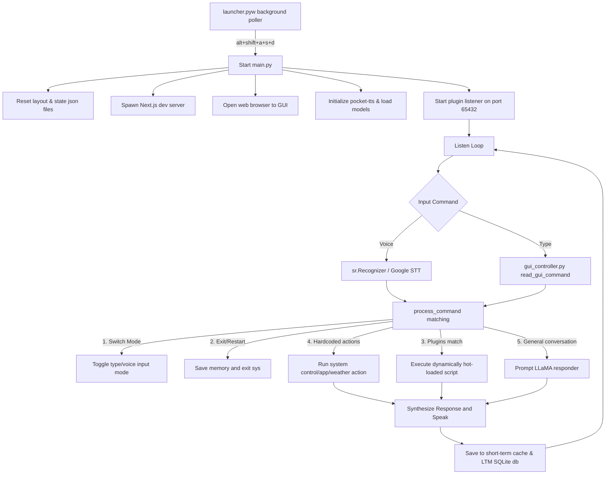

# A.L.F.R.E.D

**Automated Limited Functionality Responsive Educational Development (system)**

A.L.F.R.E.D is a chat-based, responsive, command-structured automation system powered by locally running pretrained Large Language Models (LLMs). It is designed to function as a background assistant capable of understanding natural language commands and executing system-level actions on Windows.

---

### 📌 Project Overview

A.L.F.R.E.D acts as an intelligent automation layer between the user and the operating system. It combines LLM inference, speech recognition, system control, and hotkey-based background execution into a single cohesive workflow.

The project runs entirely locally using GGUF-format models via `llama_cpp`, ensuring privacy and offline functionality.

---

## Key Features

1. **Local LLM Conversations**: Integrates with `llama.cpp` to run local LLaMA GGUF models for private, low-latency conversational responses. Includes dynamic elastic text generation to prevent sentence cut-offs.
2. **Multi-threaded Voice Output**: Leverages [Kyutai's Pocket TTS](https://github.com/kyutai-labs/pocket-tts) model on CPU with sequential playback queueing to deliver high-quality text-to-speech output without blocking main loops.
3. **Voice & Type Inputs**: Speech recognition parses commands via Google STT, with immediate fallbacks to command typing in the web GUI.
4. **Persistent Memory System**: Combines short-term RAM caching of conversation context with a long-term SQLite database using FTS5 (Full-Text Search) and automatic tagging to recall, search, or forget past conversations.
5. **System Automation**: Native desktop control interfaces to adjust volume (via `pycaw`), screen brightness, open/close applications (Notepad, Command Prompt, Chrome, WhatsApp, IDEs), toggle system settings, restart, or shutdown.
6. **Next.js Web Interface**: Beautiful interactive GUI visualizer displaying logs, active query status, dynamic visual components, error popups, and media outputs.
7. **Detachable Plugin Hot-Loading**: Connects with the Octopus compiler framework over local socket connections to dynamically hot-reload python modules at runtime.
8. **Real-time Resource Monitoring**: Integrated CPU/RAM stats collector for system status feedback and voice status responses.
9. **Thread-Safe Daily Latency Profiling**: Automatically tracks execution latency across all core functions with high-precision sub-second tracking, daily file segregation, exit grouping by function, and summary metrics.
10. **Native Log Compression & Archiving**: Custom binary compression (`.compressed_logs` with magic header `ALF1`, CRC32 validation, and zlib level 9 compression) for rotated daily logs and latency traces.
11. **Environment Hardening**: All backend routing connections are dynamically resolved through `.env` configurations.

---

## File Structure

The project layout organizes files systematically across frontend, plugins framework, and core Python modules:

```
Project/
├── .env                  # Local environment configurations (ignored by git)
├── .gitignore            # Git exclusion guidelines
├── alfred_voice.py       # Multi-threaded Pocket-TTS synthesis module
├── launcher.pyw          # Background service hotkey and health check poller
├── LICENSE               # MIT License
├── main.py               # Main application entry point
├── README.md             # Project documentation
├── requirements.txt      # Python dependencies manifest
├── version.py            # Project constants and network metadata
├── Data/                 # GUI settings, config, and layout states
│   ├── config.json       # Interactive layout widgets configuration
│   ├── layout_state.json # Pinned and layout zones memory
│   └── command.txt       # GUI typed command bridge
├── FILES/                # Core Python modules
│   ├── commands.py       # Core mapped system command routines
│   ├── gui_controller.py # Configuration and GUI interaction module
│   ├── intent.py         # Experimental intent classifier / BERT trainer
│   ├── LATENCY_RECORDER.py # Thread-safe file-based latency profiler & CLI
│   ├── log_compressor.py # Custom binary log compressor (.compressed_logs)
│   ├── logger.py         # Centralized timed rotating daily log handler
│   ├── long_term_memory.py # Standalone SQLite conversation memory database
│   ├── memory.py         # RAM cache / LTM integration layer
│   ├── model_manager.py  # Loader / unloader for local GGUF models
│   ├── plugin_host.py    # Hot-reload plugin compiler socket interface
│   ├── resource_monitor.py # System CPU/RAM tracking module
│   ├── system_control.py # Pycaw volume / Screen-brightness control routines
│   ├── util_functions.py # Multi-replace, search tools, microphone listener
│   ├── utils.py          # LLaMA responder loop interface
│   ├── window_manager.py # pygetwindow layout helper static class
│   └── youtube_player.py # yt-dlp search stream URL extraction
├── FmWk/                 # Detachable Octopus Plugin compile framework
├── gui/                  # Next.js web GUI interface
│   ├── app/              # Main layout, styles, page and api endpoints
│   │   ├── api/          # Internal JSON routes (config, command, logs)
│   │   │   ├── command/  # Route to post shell commands
│   │   │   │   └── route.js
│   │   │   ├── config/   # Route to get/set layout variables
│   │   │   │   └── route.js
│   │   │   ├── error/    # Route to submit UI crash errors
│   │   │   │   └── route.js
│   │   │   ├── logs/     # Route to stream background execution logs
│   │   │   │   └── route.js
│   │   │   └── unpin_zone/ # Route to restore zone placement
│   │   │       └── route.js
│   │   ├── favicon.ico   # Browser tab icon
│   │   ├── globals.css   # Global page styling and animations
│   │   ├── layout.js     # Shared shell layout configuration
│   │   ├── page.js       # Core GUI display and interaction page
│   │   └── page.module.css # Component-specific stylesheet
│   ├── public/           # Static assets (svg icons)
│   ├── jsconfig.json     # VSCode JS mapping configurations
│   ├── package.json      # Node.js project configuration
│   └── next.config.mjs   # Next.js server configuration
```

---

## Basic Principles

- **Optimal Reusability**: Common helpers such as string replacement and sound synthesis are centralized under `FILES/util_functions.py` and `alfred_voice.py`.
- **Zero-Hardcoding**: Endpoints like `OpenWeatherKey` are sourced dynamically from `.env`.
- **Structured Operations Logging**: Every module utilizes a centralized logger in `FILES/logger.py` writing rotating logs to `logs/alfred.log` at the `DEBUG` level while displaying essential information to the console.
- **Detachable Ecosystem**: The `FmWk/` directory represents a fully decoupled microservice structure with its own git history. It communicates with the main workspace solely via network requests and standard socket protocols.

---

## Workflow of the Project



---

## Setup & Execution

### 1. Prerequisites
Ensure you have Python 3.10+ and Node.js installed.

### 2. Installation
Install the required dependencies:
```bash
pip install -r requirements.txt
```

Navigate to the `gui/` directory and install the Node.js packages:
```bash
cd gui
npm install
```

### 3. Environment Config
Create a `.env` file in the root directory:
```env
OpenWeatherKey=your-openweather-api-key
```

### 4. Run Launcher
To run ALFRED in the background:
```bash
pythonw launcher.pyw
```
Press `alt+shift+a+s` followed by `d` to summon the interface.

To run the application directly in terminal mode:
```bash
python main.py
```

---

## System Logging & Latency Tracking

### 1. Operations Logging
All application executions, requests, socket connections, and exceptions are logged to:
- Console outputs
- **`logs/alfred.log`** (Rotates daily, retains last 7 days of debug logs)
- Rotated logs are automatically compressed to `.compressed_logs` on shutdown via `FILES/log_compressor.py`.

### 2. Latency Profiler & CLI
Latency is captured on a per-call basis via the `@track_latency` decorator and written to `logs/latency/YYYY-MM-DD.log`. On application shutdown (`atexit`), logs are automatically reorganized by function name, annotated with summary statistics, and compressed.

Inspect latency metrics via the CLI:
```bash
# Decompress and show first 50 lines of a specific date
python .\FILES\LATENCY_RECORDER.py --show 2026-09-01

# Limit number of lines displayed
python .\FILES\LATENCY_RECORDER.py --show 2026-09-01 --lines 20

# Filter records and summaries for a specific function
python .\FILES\LATENCY_RECORDER.py --show 2026-09-01 --function-name commands.process_command

# List all available recorded dates and archive sizes
python .\FILES\LATENCY_RECORDER.py --list

# Clean up records older than 15 days
python .\FILES\LATENCY_RECORDER.py --clean
```

---

### 💻 System Requirements (Tested On)

- **Operating System**: Windows
- **Python Version**: Python 3.12.6 (64-bit)
- **Architecture**: x86-64 CPU (no GPU required)

---

### ⚠️ Disclaimer

This project is intended for educational and experimental purposes. Users are responsible for the commands executed by the system.

---

## License

This project is licensed under the MIT License. See the [LICENSE](LICENSE) file for details.
