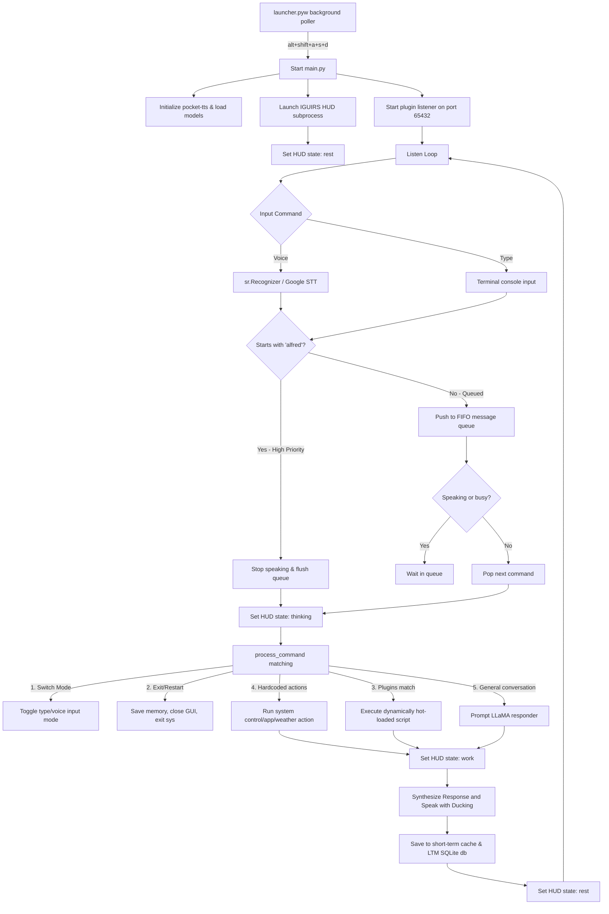

# A.L.F.R.E.D

**Automated Logistics for Facilitating Resources and Executive Duties**

A.L.F.R.E.D is a chat-based, responsive, command-structured automation system powered by locally running pretrained Large Language Models (LLMs). It is designed to function as a background assistant capable of understanding natural language commands and executing system-level actions on Windows.

---

### 📌 Project Overview

A.L.F.R.E.D acts as an intelligent automation layer between the user and the operating system. It combines LLM inference, speech recognition, system control, hotkey-based background execution, and an independent GUI rendering HUD with process-isolated multi-window capabilities into a single cohesive workflow.

The project runs entirely locally using GGUF-format models via `llama_cpp`, ensuring privacy and offline functionality.

---

## Key Features

1. **Local LLM Conversations**: Integrates with `llama.cpp` to run local LLaMA GGUF models for private, low-latency conversational responses. Includes dynamic elastic text generation to prevent sentence cut-offs.
2. **Multi-threaded Voice Output**: Leverages [Kyutai's Pocket TTS](https://github.com/kyutai-labs/pocket-tts) model on CPU with sequential playback queueing to deliver high-quality text-to-speech output without blocking main loops.
3. **Voice & Type Inputs**: Speech recognition parses commands via Google STT, with terminal text input support.
4. **FIFO Priority Message Queue & Voice Interrupt**: Sequential FIFO message queue for continuous query execution. Commands starting with the keyword `alfred` receive high-priority preemption—flushing lower-priority queues, instantly cutting speech playback, and executing immediately.
5. **IGUIRS (Independent GUI Rendering System)**:
   - **Direct Frame Streaming Avatar HUD**: Renders real-time animation frames directly from compressed GIF containers across distinct assistant states (`rest`, `listening`, `thinking`, `work`). Frameless, draggable, topmost HUD with live scale reduction (`size_reduce_percentage`) and configurable target FPS via `config.json`.
   - **Process-Isolated Dynamic Windows**: Dynamic secondary windows run in fully isolated child OS processes (`IGUIRS/window_process.py`), preventing secondary window crashes, Tkinter Tcl apartment deadlocks, or video decoding segfaults from affecting the main HUD avatar.
   - **Dynamic Video Engine & Player**: Integrated yt-dlp search with multi-option interactive selector dialog (`VideoSelectorModal`), background stream resolution, frameless 800x600 video window (`DynamicVideoWindow`) locked to audio clock via PyAudio and FFmpeg subprocess, OpenCV-accelerated frame rendering, and automatic garbage collection on stream termination.
   - **Programmatic Controller**: Clean programmatic API (`FILES/gui_controller.py`) for state switching, dynamic window spawning, and config-only resizing.
6. **TurboQuant Vector Quantization Engine**: High-performance vector quantization and codebook operations accelerated via compiled Cython C-extensions (`FILES/turbo_ops.pyx` / `.pyd`).
7. **Enhanced App & Web Launcher**: Space-agnostic registry matching (`$ task manager` / `$taskmanager`) with expanded direct web endpoints including Gemini (`$gemini`), ChatGPT, StackOverflow, Google, and YouTube Music.
8. **Persistent Memory System**: Combines short-term RAM caching of conversation context with a long-term SQLite database using FTS5 (Full-Text Search) and automatic tagging to recall, search, or forget past conversations.
9. **System Automation**: Native desktop control interfaces to adjust volume (via `pycaw`), screen brightness, open/close applications (Notepad, Command Prompt, Chrome, WhatsApp, IDEs), toggle system settings, restart, or shutdown.
10. **Model Context Protocol (MCP) Intermediary Bridge**: Connects ALFRED to the Octopus MCP engine using a dedicated async daemon and synchronous facade, supporting fast-path keyword routing, local Qwen tool classification, and standard stdio external tools.
11. **Real-time Resource Monitoring**: Integrated CPU/RAM stats collector for system status feedback and voice status responses.
12. **Thread-Safe Daily Latency Profiling**: Automatically tracks execution latency across all core functions with high-precision sub-second tracking, daily file segregation, exit grouping by function, and summary metrics.
13. **Native Log Compression & Archiving**: Custom binary compression (`.compressed_logs` with magic header `ALF1`, CRC32 validation, and zlib level 9 compression) for rotated daily logs and latency traces.
14. **Smart Audio Ducking**: Automatically detects external audio streams via `pycaw` and ducks volume by 85% during ALFRED speech playback, seamlessly restoring volume upon completion or voice interrupt.

---

## File Structure

The project layout organizes files systematically across frontend, plugins framework, and core Python modules:

```
Project/
├── .env                  # Local environment configurations (ignored by git)
├── .gitignore            # Git exclusion guidelines
├── alfred_voice.py       # Multi-threaded Pocket-TTS synthesis module with voice interrupt
├── launcher.pyw          # Background service hotkey and health check poller
├── LICENSE               # MIT License
├── main.py               # Main application entry point with priority queue & GUI lifecycle
├── README.md             # Project documentation
├── requirements.txt      # Python dependencies manifest
├── test_dynamic_gui.py   # Interactive test harness for IGUIRS multi-window & states
├── version.py            # Project constants and network metadata
├── Data/                 # Application data and logs
├── FILES/                # Core Python modules
│   ├── audio_ducker.py   # Smart volume ducking for background audio during speech
│   ├── command_components/ # Modular system command subroutines
│   │   ├── app_launcher.py      # App launch, space-agnostic web registry & lifecycle
│   │   ├── log_commands.py      # Log viewer and compression triggers
│   │   ├── memory_commands.py   # LTM recall, search, and forget commands
│   │   ├── search.py            # Google and web queries
│   │   ├── system_status.py     # Battery, CPU, RAM metrics
│   │   └── weather_commands.py  # Weather updates
│   ├── commands.py       # Core mapped system command routines
│   ├── gui_controller.py # Controller interface for IGUIRS HUD & dynamic windows
│   ├── intent.py         # Experimental intent classifier / BERT trainer
│   ├── LATENCY_RECORDER.py # Thread-safe file-based latency profiler & CLI
│   ├── log_compressor.py # Custom binary log compressor (.compressed_logs)
│   ├── logger.py         # Centralized timed rotating daily log handler
│   ├── long_term_memory.py # Standalone SQLite conversation memory database
│   ├── memory.py         # RAM cache / LTM integration layer
│   ├── model_manager.py  # Loader / unloader for local GGUF models
│   ├── plugin_host.py    # Octopus Model Context Protocol (MCP) Bridge adapter
│   ├── resource_monitor.py # System CPU/RAM tracking module
│   ├── system_control.py # Pycaw volume / Screen-brightness control routines
│   ├── turbo_ops.pyd     # Compiled Cython accelerated quantization operations
│   ├── turbo_ops.pyx     # Cython source for TurboQuant vector operations
│   ├── turbo_quant.py    # TurboQuant vector quantization engine
│   ├── util_functions.py # Multi-replace, search tools, microphone listener
│   ├── utils.py          # LLaMA responder loop interface
│   ├── web_search_extractor.py # Web search extractor
│   ├── window_manager.py # pygetwindow layout helper static class
│   └── youtube_player.py # yt-dlp resilient search and stream extraction
├── IGUIRS/               # Independent GUI Rendering System
│   ├── config.json       # Real-time state and dynamic window registry
│   ├── renderer.py       # Main HUD avatar frame streaming renderer & process manager
│   ├── video_engine.py   # Multi-option selector dialog & dynamic video player
│   ├── window_process.py # Isolated child process runner for crash-resilient secondary windows
│   └── Graphics/         # Direct frame streaming assets and animated GIF containers
│       ├── gifs/         # Compiled multi-frame GIF containers (rest, work, thinking, listening)
│       ├── listening/    # Source frame sequence for listening state
│       ├── rest/         # Source frame sequence for rest state
│       ├── thinking/     # Source frame sequence for thinking state
│       └── work/         # Source frame sequence for work state
├── FmWk/                 # Octopus Model Context Protocol (MCP) framework (external repo)
└── research/             # MCP deep research and tool development guides
```

---

## Basic Principles

- **Process Isolation**: Dynamic secondary windows operate in dedicated OS processes with independent Tkinter event loops; crashes in video streaming or external decoders cannot terminate the main assistant HUD.
- **Direct Streaming Over Full Buffering**: Animation frames stream directly from container files to eliminate memory spikes and enable instant state changes.
- **Priority-Driven Preemption**: Direct user commands prefixed with `alfred` override background task queues and interrupt ongoing speech immediately.
- **Optimal Reusability**: Common helpers such as string replacement, audio ducking, and sound synthesis are centralized under `FILES/util_functions.py` and `alfred_voice.py`.
- **Zero-Hardcoding**: Endpoints like `OpenWeatherKey` are sourced dynamically from `.env`.
- **Structured Operations Logging**: Every module utilizes a centralized logger in `FILES/logger.py` writing rotating logs to `logs/alfred.log` at the `DEBUG` level while displaying essential information to the console.

---

## Workflow of the Project


```mermaid
flowchart TD
    Launcher[launcher.pyw background poller] -->|alt+shift+a+s+d| Launch[Start main.py]
    Launch --> InitTTS[Initialize pocket-tts & load models]
    Launch --> InitGUI[Launch IGUIRS HUD subprocess]
    Launch --> StartSocket[Start plugin listener on port 65432]
    
    InitGUI --> SetRest[Set HUD state: rest]
    StartSocket --> Loop[Listen Loop]
    Loop --> Input{Input Command}
    Input -->|Voice| Speech[sr.Recognizer / Google STT]
    Input -->|Type| ConsoleInput[Terminal console input]
    
    Speech --> QueueCheck{Starts with 'alfred'?}
    ConsoleInput --> QueueCheck
    
    QueueCheck -->|Yes - High Priority| Interrupt[Stop speaking & flush queue]
    Interrupt --> SetThinking[Set HUD state: thinking]
    QueueCheck -->|No - Queued| Enqueue[Push to FIFO message queue]
    
    Enqueue --> CheckBusy{Speaking or busy?}
    CheckBusy -->|Yes| Wait[Wait in queue]
    CheckBusy -->|No| PopQueue[Pop next command]
    PopQueue --> SetThinking
    
    SetThinking --> Process[process_command matching]
    
    Process -->|1. Switch Mode| Toggle[Toggle type/voice input mode]
    Process -->|2. Exit/Restart| Terminate[Save memory, close GUI, exit sys]
    Process -->|3. Plugins match| PluginRun[Execute dynamically hot-loaded script]
    Process -->|4. Hardcoded actions| SysAction[Run system control/app/weather action]
    Process -->|5. General conversation| LLMResponse[Prompt LLaMA responder]
    
    SysAction --> SetWork[Set HUD state: work]
    PluginRun --> SetWork
    LLMResponse --> SetWork
    
    SetWork --> Speak[Synthesize Response and Speak with Ducking]
    Speak --> SaveMem[Save to short-term cache & LTM SQLite db]
    SaveMem --> SetRest2[Set HUD state: rest]
    SetRest2 --> Loop
```

---

## Independent GUI Rendering System (IGUIRS)

IGUIRS provides an animated visual presence and multi-window streaming display:

### 1. Main HUD Avatar
- Reads animation frames directly from compressed GIF containers in `IGUIRS/Graphics/gifs/`.
- Switches states on demand: `rest`, `listening`, `thinking`, `work`.
- Drag-and-drop repositioning anywhere on screen.
- Config-driven live resizing (`size_reduce_percentage`) without restarts.

### 2. Process-Isolated Secondary Windows
- Secondary windows (such as video playback or user selection dialogs) spawn via `IGUIRS/window_process.py` in separate OS processes.
- Memory and event loops remain isolated: if a video decoder, PyAudio stream, or OpenCV process encounters an unhandled exception or terminates, the main HUD avatar continues rendering seamlessly.
- Automatically cleans up `IGUIRS/config.json` upon window termination and executes explicit Python garbage collection (`gc.collect()`).

### 3. Interactive Testing
Launch the dynamic window test runner to test HUD states and multi-window spawning interactively:
```bash
python test_dynamic_gui.py
```
Supported interactive commands:
- Enter any search query or YouTube URL to spawn a dynamic video window.
- `state <name>`: Switch avatar state (`rest`, `listening`, `thinking`, `work`).
- `resize <win_id> <w> <h>`: Dynamically resize a window via config (e.g. `resize window_1 1024 768`).
- `close <win_id>`: Close and garbage-collect a dynamic window.

---

## Setup & Execution

### 1. Prerequisites
Ensure you have Python 3.10+ (tested on Python 3.12 and 3.14 64-bit) installed.

### 2. Installation
Install the required dependencies:
```bash
pip install -r requirements.txt
```

### 3. Environment Config
Create a `.env` file in the root directory:
```env
OpenWeatherKey=your-openweather-api-key
```

### 4. Run Launcher
To run ALFRED in the background:
```bash
pythonw launcher.pyw
```
Press `alt+shift+a+s` followed by `d` to summon the interface.

To run the application directly in terminal mode:
```bash
python main.py
```

---

## System Logging & Latency Tracking

### 1. Operations Logging
All application executions, requests, socket connections, and exceptions are logged to:
- Console outputs
- **`logs/alfred.log`** (Rotates daily, retains last 7 days of debug logs)
- Rotated logs are automatically compressed to `.compressed_logs` on shutdown via `FILES/log_compressor.py`.

### 2. Latency Profiler & CLI
Latency is captured on a per-call basis via the `@track_latency` decorator and written to `logs/latency/YYYY-MM-DD.log`. On application shutdown (`atexit`), logs are automatically reorganized by function name, annotated with summary statistics, and compressed.

Inspect latency metrics via the CLI:
```bash
# Decompress and show first 50 lines of a specific date
python .\FILES\LATENCY_RECORDER.py --show 2026-09-01

# Limit number of lines displayed
python .\FILES\LATENCY_RECORDER.py --show 2026-09-01 --lines 20

# Filter records and summaries for a specific function
python .\FILES\LATENCY_RECORDER.py --show 2026-09-01 --function-name commands.process_command

# List all available recorded dates and archive sizes
python .\FILES\LATENCY_RECORDER.py --list

# Clean up records older than 15 days
python .\FILES\LATENCY_RECORDER.py --clean
```

---

### 💻 System Requirements (Tested On)

- **Operating System**: Windows 10 / Windows 11
- **Python Version**: Python 3.12.6 / Python 3.14 (64-bit)
- **Architecture**: x86-64 CPU (no discrete GPU strictly required)

---

### ⚠️ Disclaimer

This project is intended for educational and experimental purposes. Users are responsible for the commands executed by the system.

---

## License

This project is licensed under the MIT License. See the [LICENSE](LICENSE) file for details.
